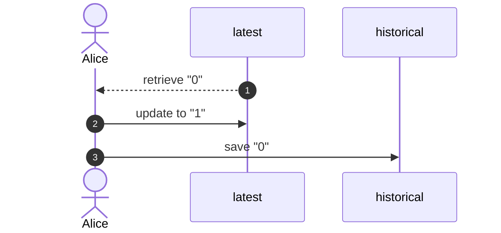
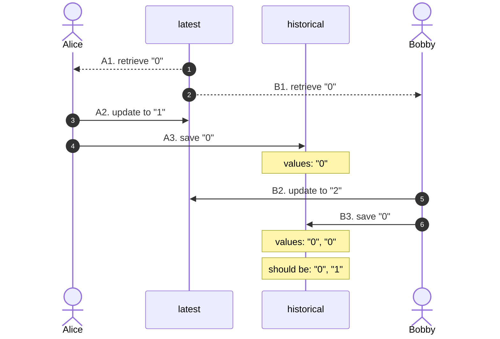

# optimistic-mongo

When it comes to data access concurrency issues, _skewed writes_ are about as troublesome as they get. Even explaining how they happen and getting your point across can be a challenge. With MongoDB and Spring there is an easy and clean solution. I was excited to find and implement it in one of current projects in Evojam, and would love to share it. But let me start with an example and a picture explanation of what this type of issue is about.

## Example

Let's say we have two collections: `latest` and `historical`. When an item gets updated, there are two writes involved. The first updates the document in collection `latest`. The second saves the previous value as a new document to collection `historical`.

The diagram below shows all three steps involved in an update performed by a client named Alice:

1. Fetch previous value
2. Update `latest`
3. Save previous value to `historical`



## Problem

Issues arise if two clients start performing updates at the same time.

In the scenario below, Bobby retrieves value "0" right after Alice. He does that before Alice manages to complete her update. Unaware of the new value sent by Alice, Bobby updates the document in collection `latest`, and then saves "0" to collection `historical`. As far as Bobby knows, "0" is still the previous value.

We call this type of errors _skewed writes_. Bobby does everything by the book. His only problem is his outdated (hence _skewed_) information.



Let's model the update operation using Kotlin. We need two data classes for two collections. Updating a `LatestItem` is going to produce a `Pair` consisting of the updated `LatestItem` as well as its previous value. The latter can then be stored to the "historical" collection. This is what the implementation looks like:

```kotlin
@Document("latest")
data class LatestItem(
    @Id val id: Int,
    val item: Item,
) {
    fun next(value: String) = Pair(
        copy(item = Item(id, value)),
        item
    )
}

@Document("historical")
data class Item(
    val itemId: Int,
    val value: String,
)
```

If you're curious about the boilerplate code that links `LatestItem` and `Item` to Spring Data repositories, have a look at `ItemUpdater#updateItem`.

Testing the service in a concurrent setting is going to be more interesting to us. Below, you can see the test method from `ItemUpdaterTest`. It puts an initial value inside the "latest" collection. Then, it starts runs 5 concurrent updates, waits for them to complete, and issues a final update to value _final_.

The assertion at the end fails. Not all intermittent values find their way to the "historical" collection.

```groovy
def "history retained"() {
    when:
    updater.addItem(1, '0')

    and:
    def integers = (1..5).toList().collect { it as String }
    integers.collect { number -> CompletableFuture.supplyAsync { updater.updateItem(1, number) } }
            .collect { future -> future.get() }

    and:
    updater.updateItem(1, 'final')

    then:
    with(historical.findAll().collect { it.value }) {
        it.containsAll(integers)
    }
}
```

To see why, let's have a look at the logs:

```
19:14:53.007 : (??) from "0" to "5"
19:14:53.008 : (??) from "0" to "3"
19:14:53.007 : (??) from "0" to "4"
19:14:53.007 : (??) from "0" to "1"
19:14:53.008 : (??) from "0" to "2"
19:14:53.024 : (ok) from "0" to "2"
19:14:53.024 : (ok) from "0" to "3"
19:14:53.026 : (ok) from "0" to "4"
19:14:53.026 : (ok) from "0" to "5"
19:14:53.031 : (ok) from "0" to "1"
```

Each line starting with "(??)" marks the start of an attempted update. Each line starting with "(ok)" signals an update that is written to the database. We can see how all 5 concurrent updates fetch "0" as the latest value. They then each update "0" to another value. The error lies in what gets stored in "historical", and that is only "0". Each thread thinks that the previous latest value is "0". Nothing else gets stored in the "historical" collection.

## Solution

First, we introduce an integer field annotated with `@Version`:

```kotlin
@Document("latest")
data class OptimisticItem(
    @Id val id: Int,
    val item: Item,

    @Version val version: Int = 0,
)
```

Then, we pull out the fetch and update code to a method, so it can be retried:

```kotlin
@Retryable(value = [DataAccessException::class], maxAttempts = 10)
fun update(id: Int, value: String) = latest.findById(id)
    ?.next(value)
    ?.let { (newLatest, newHistorical) -> update(newLatest, newHistorical) }
```

If you want to see this in details, take a look at the `OptimisticUpdater` and `RetryableUpdater` classes. The reason for having two separate classes is the use of Spring AOP in `@Retryable`. Only calls between Spring Beans can be intercepted this way.

Let's have a look at the logs again.

This time, they are telling a different story. For better clarity, I divided them into sections. Each section in the next iteration. You can see how, at first, all 5 threads try to update "0" to their new values. The update to "4" wins and all the rest need to be retried in the next iteration. Now "1" wins and all the rest need to be retried. This happens again, until there are no updates left to retry.

```
19:27:24.274 : (??) from "0" to "2"
19:27:24.275 : (??) from "0" to "3"
19:27:24.274 : (??) from "0" to "5"
19:27:24.275 : (??) from "0" to "4"
19:27:24.275 : (??) from "0" to "1"
19:27:24.327 : (ok) from "0" to "4"

19:27:25.341 : (??) from "4" to "3"
19:27:25.341 : (??) from "4" to "5"
19:27:25.341 : (??) from "4" to "1"
19:27:25.343 : (??) from "4" to "2"
19:27:25.354 : (ok) from "4" to "1"

19:27:26.361 : (??) from "1" to "2"
19:27:26.361 : (??) from "1" to "3"
19:27:26.365 : (??) from "1" to "5"
19:27:26.365 : (ok) from "1" to "3"

19:27:27.381 : (??) from "3" to "5"
19:27:27.381 : (??) from "3" to "2"
19:27:27.386 : (ok) from "3" to "5"

19:27:28.397 : (??) from "5" to "2"
19:27:28.400 : (ok) from "5" to "2"

19:27:28.404 : (??) from "2" to "final"
19:27:28.406 : (ok) from "2" to "final"
```

## Summary

Optimistic locking is a workable solution for _skewed writes_ errors. Transactions themselves are not enough in this case, because no consistency guarantees get violated. Thanks to Spring Data MongoDB versioning and retries, it is possible to handle the situation gracefully without much boilerplate code.

Concurrency problems in databases are equally troublesome to those happening in your code. They deserve equal attention and ability to foresee the trickiest scenarios. This is not easy, but at the same time a lot of fun. Especially if you still find a way to write code that is easy to read and maintain.
