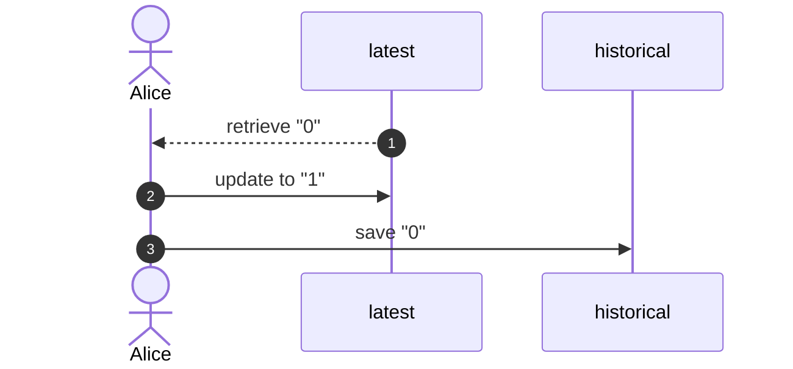
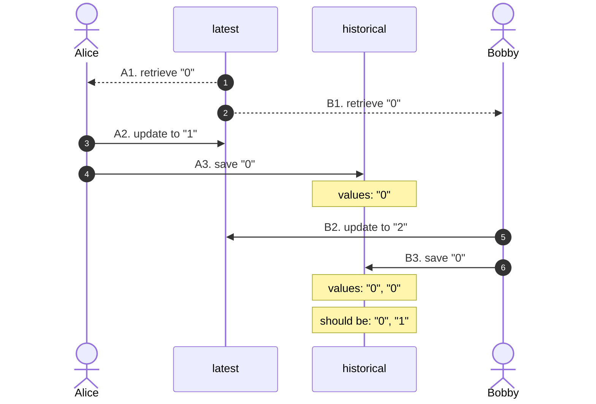

# optimistic-mongo

Optimistic locking solution for write skews

## Example

Let's say we have two collections: `latest` and `historical`. When an item gets updated, there are two writes involved. The first updates the document in collection `latest`. The second saves the previous value as a new document to collection `historical`.

The diagram below shows all three steps involved in an update performed by a client named Alice:

1. Fetch previous value
2. Update `latest`
3. Save previous value to `historical`



## Problem

Issues can arise if two clients start performing updates at the same time.

In the scenario below, Bobby retrieves value "0" right after Alice. He does that before Alice manages to complete her update. Unaware of the new value sent by Alice, Bobby updates the document in collection `latest`, and then saves "0" to collection `historical`. As far as Bobby knows, "0" is still the previous value.

We call this type of errors _skewed writes_. Bobby does everything by the book. His only problem is his outdated (hence _skewed_) information.




## Solution

Introduce an integer field annotated with `@Version`:

```kotlin
@Document("latest")
data class OptimisticItem(
    @Id val id: Int,
    val item: Item,

    @Version val version: Int = 0,
)
```

Pull out the fetch and update code to a method, so it ca be retried:

```kotlin
@Retryable(value = [DataAccessException::class], maxAttempts = 10)
fun update(id: Int, value: String) = latest.findById(id)
    ?.next(value)
    ?.let { (newLatest, newHistorical) -> update(newLatest, newHistorical) }
```
